# Information Architecture (LoadPulse Web App)

## 1. Top-level navigation (`src/pages`, routes in `src/App.tsx`)
```
/          → Run  — Test Builder (cURL/Postman import, config, run, live results)   [eager]
/history   → History — table of past local runs                                     [lazy]
/compare   → Compare — side-by-side A/B of two history runs                          [lazy]
/swarm     → Swarm  — distributed multi-device load test (host/join)                 [lazy]
/docs      → Docs   — full CLI + Web usage guide                                     [lazy]
/report    → SharedReport — URL-hash-encoded report view (no nav shell)              [lazy]
```
- The nav bar links to Run, History, Compare, 🐝 Swarm, and Docs. `/report` has **no** nav link — it is reached only by opening a shared URL and renders standalone (its own chrome, no app shell).
- All routes except `/` are `React.lazy`-loaded (see `d629c14` perf change); `xlsx` and the Swarm chunk are also dynamically imported.
- A dark/light theme toggle (persisted to `localStorage` key `_lp_theme`) and a PWA install banner live in the shared shell.

## 2. Run (Test Builder) page — section hierarchy (diagram)

```mermaid
flowchart TD
    TB[Run / Test Builder]
    TB --> IMP[1. Import]
    IMP --> IMP1[Paste cURL]
    IMP --> IMP2[Import Postman collection]
    IMP --> IMP3[Presets]

    TB --> LP[2. Load Pattern config]
    LP --> LP1[Constant]
    LP --> LP2[Ramp]
    LP --> LP3[Step]
    LP --> LP4[Spike]
    LP --> LP5[Soak]

    TB --> SC[3. Success Criteria]
    SC --> SC1[Status code range]
    SC --> SC2[Latency threshold]
    SC --> SC3[Body keyword check]
    SC --> SC4[Auto-stop on error rate]

    TB --> CH["4. Chaining (optional)"]
    CH --> CH1[Auth step → extract variable → inject]

    TB --> RUN[5. Run controls]
    TB --> RES[6. Results]
    RES --> RES1[Live latency chart]
    RES --> RES2[Throughput chart]
    RES --> RES3[Status code distribution]
    RES --> RES4[Latency histogram]
    RES --> RES5[Apdex / SLA summary + percentiles]
    RES --> RES6[Failure groups]
    RES --> RES7[Export: Share URL / JSON / Markdown / CSV / Excel / Config JSON]
```


## 2b. Run (Test Builder) page — section hierarchy (text)
```
Run / Test Builder
├── 1. Import
│   ├── Paste cURL
│   ├── Import Postman collection
│   └── Presets
├── 2. Load Pattern config
│   ├── Constant
│   ├── Ramp
│   ├── Step
│   ├── Spike
│   └── Soak
├── 3. Success Criteria
│   ├── Status code range
│   ├── Latency threshold
│   ├── Body keyword check
│   └── Auto-stop on error rate
├── 4. Chaining (optional)
│   └── Auth step → extract variable → inject into main request
├── 5. Run controls (start / stop / reset; ⌘/Ctrl+Enter run, Esc stop)
└── 6. Results
    ├── Live latency chart
    ├── Throughput chart
    ├── Status code distribution
    ├── Latency histogram
    ├── Apdex / SLA summary + percentile table
    ├── Failure groups (grouped by type: net / 4xx / 5xx)
    └── Export (Share URL, JSON, Markdown, CSV, Excel .xlsx, Config JSON)
```

## 2c. Swarm page — section hierarchy
```
Swarm
├── Host
│   ├── Paste cURL + pick pattern (+ optional room passcode)
│   ├── Create swarm room → room code + join link + QR
│   ├── Waiting room: connected nodes (with kick)
│   └── Start swarm test → aggregated live results + per-node latency bars + Export Report (JSON)
└── Join
    ├── Enter room code (auto-filled from ?join=<code>) + passcode
    └── Node view: this node's own contribution to the run
```

## 3. State ownership (maps IA to code)
- `store/testStore.ts` — active test config + live solo-run state, live chart points, auto-stop, report build
- `store/historyStore.ts` — past run records (`RunRecord[]`), persisted to `localStorage` (key `_alt2_hist`, capped to the 10 most recent)
- `store/swarmStore.ts` — swarm session state: connected nodes, aggregated stats, swarm report export
- `lib/types.ts` — shared shape contracts (`TestConfig`, `ReportData`, `RunRecord`); `lib/swarm/types.ts` — swarm message + node types

## 4. Content model
| Entity | Where defined | Persisted? |
|---|---|---|
| TestConfig | `lib/types.ts` | Not stored server-side; the UI exports a flattened `CliExportConfig` (see `05-report-schema.md`) as `loadpulse.json` |
| CliExportConfig | `lib/exportConfig.ts` | Downloaded as `loadpulse.json` for the CLI |
| ReportData | `lib/types.ts` | Encoded into share URL (base64 in `#data=` fragment), or CLI `--json` output |
| RunRecord | `lib/types.ts` | Local history only — `localStorage` key `_alt2_hist`, last 10 runs |
| SwarmMessage / SwarmNodeState | `lib/swarm/types.ts` | In-memory only; exchanged over WebRTC data channels during a swarm run |

## 5. Navigation principles
- Run (`/`) is the core loop (import → configure → run → results) — a single-page flow, no wizard
- History, Compare, Swarm, and Docs are separate lazy-loaded routes behind the shared app shell
- `/report` is standalone (no app shell) so a shared report renders cleanly and can be statically hosted (GitHub Pages)
- No auth-gated sections — everything is accessible with no login (swarm passcodes gate a *room*, not the app)
