# Information Architecture (LoadPulse Web App)

## 1. Top-level navigation (`src/pages`)
```
/                → Home / Test Builder (cURL import, config, run)
/docs            → Full CLI + Web usage guide
(shared report)  → URL-encoded report view (no route storage, state in URL hash/query)
```

## 2. Test Builder page — section hierarchy (diagram)

```mermaid
flowchart TD
    TB[Test Builder]
    TB --> IMP[1. Import]
    IMP --> IMP1[Paste cURL]
    IMP --> IMP2[Import Postman collection]

    TB --> LP[2. Load Pattern config]
    LP --> LP1[Constant]
    LP --> LP2[Ramp]
    LP --> LP3[Step]
    LP --> LP4[Spike]
    LP --> LP5[Soak]

    TB --> SC[3. Success Criteria]
    SC --> SC1[Status code range]
    SC --> SC2[Latency threshold]
    SC --> SC3[Body keyword check]
    SC --> SC4[Auto-stop on error rate]

    TB --> CH["4. Chaining (optional)"]
    CH --> CH1[Auth step → extract variable → inject]

    TB --> RUN[5. Run controls]
    TB --> RES[6. Results]
    RES --> RES1[Live latency chart]
    RES --> RES2[Throughput chart]
    RES --> RES3[Status code distribution]
    RES --> RES4[Apdex / SLA summary]
    RES --> RES5[Failure groups]
    RES --> RES6[Export: Config JSON / Report JSON / Share URL]
```


## 2b. Test Builder page — section hierarchy (text)
```
Test Builder
├── 1. Import
│   ├── Paste cURL
│   └── Import Postman collection
├── 2. Load Pattern config
│   ├── Constant
│   ├── Ramp
│   ├── Step
│   ├── Spike
│   └── Soak
├── 3. Success Criteria
│   ├── Status code range
│   ├── Latency threshold
│   ├── Body keyword check
│   └── Auto-stop on error rate
├── 4. Chaining (optional)
│   └── Auth step → extract variable → inject into main request
├── 5. Run controls (start / stop)
└── 6. Results
    ├── Live latency chart
    ├── Throughput chart
    ├── Status code distribution
    ├── Apdex / SLA summary
    ├── Failure groups (grouped by type: net / 4xx / 5xx)
    └── Export (Config JSON, Report JSON, Share URL)
```

## 3. State ownership (maps IA to code)
- `store/testStore.ts` — active test config + live run state
- `store/historyStore.ts` — past run records (`RunRecord[]`) shown as a local history list
- `lib/types.ts` — shared shape contracts (`TestConfig`, `ReportData`, `RunRecord`)

## 4. Content model
| Entity | Where defined | Persisted? |
|---|---|---|
| TestConfig | `lib/types.ts` | Exportable as JSON, not stored server-side |
| ReportData | `lib/types.ts` | Encoded into share URL, or CLI `--json` output |
| RunRecord | `lib/types.ts` | Local history only (in-memory/localStorage via `historyStore`) |

## 5. Navigation principles
- Single-page flow for the core loop (import → configure → run → results) — no multi-step wizard/routing needed
- `/docs` is the only separate route — kept isolated so it can be statically hosted (GitHub Pages)
- No auth-gated sections — everything is accessible with no login
