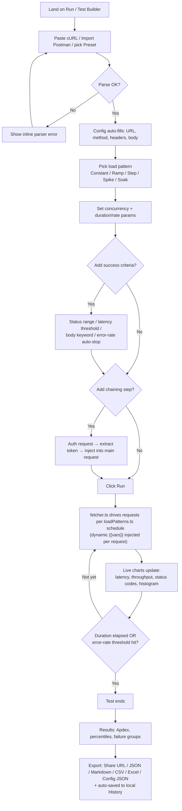
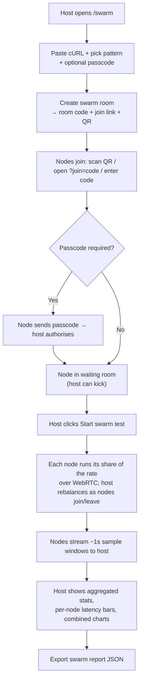
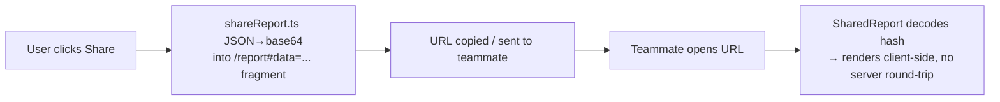
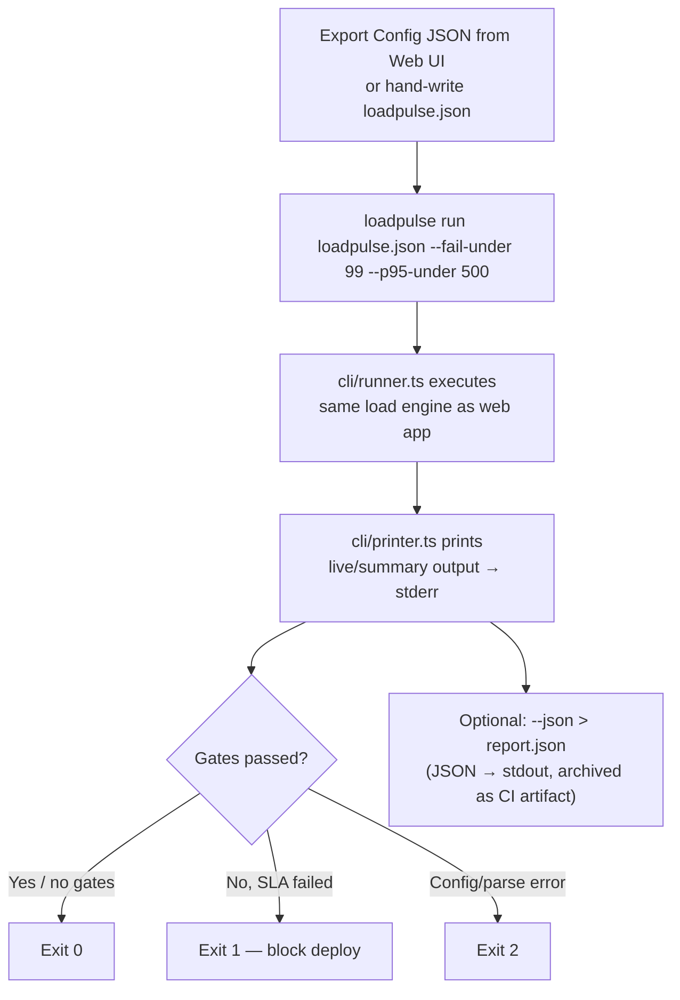

# User Flow (LoadPulse)

## Primary flow — Web App (diagram)


## Primary flow — Web App (steps)
```
1. Land on Run / Test Builder
2. Paste cURL command (or import Postman collection / pick a preset)
        ↓ curlParser.ts / postmanParser.ts
3. Config auto-fills: URL, method, headers, body
4. Pick a load pattern (Constant / Ramp / Step / Spike / Soak)
5. Set concurrency, duration/rate params
6. (Optional) Configure success criteria
   (status range, latency threshold, body keyword, error-rate auto-stop)
7. (Optional) Add a chaining step
   (run an auth request first → extract token → inject into headers/body)
8. Click "Run"  (⌘/Ctrl+Enter; Esc to stop)
        ↓ fetcher.ts drives requests per loadPatterns.ts schedule
        ↓ variableInjector.ts expands {{uuid}}/{{seq}}/{{email}}/… per request
9. Watch live charts update (latency, throughput, status codes, histogram)
10. Test ends (duration elapsed / auto-stopped on error threshold)
11. View results: Apdex score, percentiles, failure groups
12. Export (Share URL / JSON / Markdown / CSV / Excel / Config JSON); run is auto-saved to History
```

## Secondary flow — Distributed swarm

```
1. Host opens /swarm, pastes cURL, picks a pattern, optionally sets a passcode
2. "Create swarm room" → PeerJS claims id loadpulse-swarm-<code>; UI shows code + link + QR
3. Nodes join by scanning the QR, opening the ?join=<code> link, or typing the code (+ passcode)
4. Host sees connected nodes in a waiting room and can kick any node
5. Host clicks "Start swarm test" → each node runs runSwarmSlice for its live share fraction
6. Nodes emit batched sample windows over the WebRTC data channel
7. Host aggregates sent/ok/fail/percentiles across all nodes and renders combined charts + per-node bars
8. Host exports a JSON swarm report
```

## Secondary flow — History & Compare
```
1. Every completed run is prepended to local history (historyStore, last 10, localStorage _alt2_hist)
2. /history lists past runs (URL, method, pattern, elapsed, RPS, totals, success%, avg/p95/p99)
3. /compare → pick Run A and Run B → side-by-side win/lose diff on success%, RPS, avg, p95, p99, fail
```

## Secondary flow — Share a report

```
1. User clicks "Share"
        ↓ shareReport.ts JSON.stringify → base64 → /report#data=<base64>
2. URL copied / sent to teammate (payload is in the URL fragment, never sent to a server)
3. Teammate opens URL → SharedReport decodes it → report renders client-side
```

## Secondary flow — CLI in CI

```
1. Export Config JSON from the Web UI (loadpulse.json, a CliExportConfig) or hand-write it
2. `loadpulse run loadpulse.json --fail-under 99 --p95-under 500`
        ↓ cli/runner.ts executes the same core engine as the web app
3. `cli/printer.ts` prints live/summary output to the terminal (stderr)
4. Process exits: 0 (pass or no gates) / 1 (a gate failed) / 2 (config/parse error)
5. Optional: `--json > report.json` — report JSON goes to stdout, archived as a CI artifact
```

## Error / edge paths
- Invalid cURL string → parser error shown inline, user corrects and re-imports
- Network failure mid-test → captured as a failure group (`type: 'net'`), test continues
- Error rate crosses `errStopPct` → test auto-stops early, partial report generated
- CLI Ctrl-C (SIGINT) → aborts in-flight requests, then still prints the report and evaluates gates on the partial data (exit 0/1 by gate result)
- Swarm node behind a strict NAT → falls back to the public TURN relay; if that fails, the node can't join
- Swarm host disconnects → the room's well-known peer id is lost; nodes stop receiving control messages
