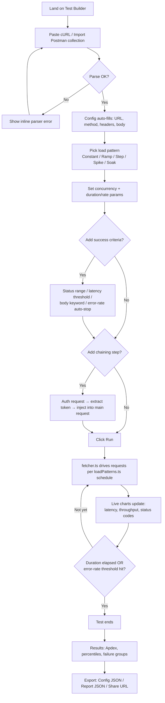
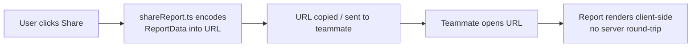
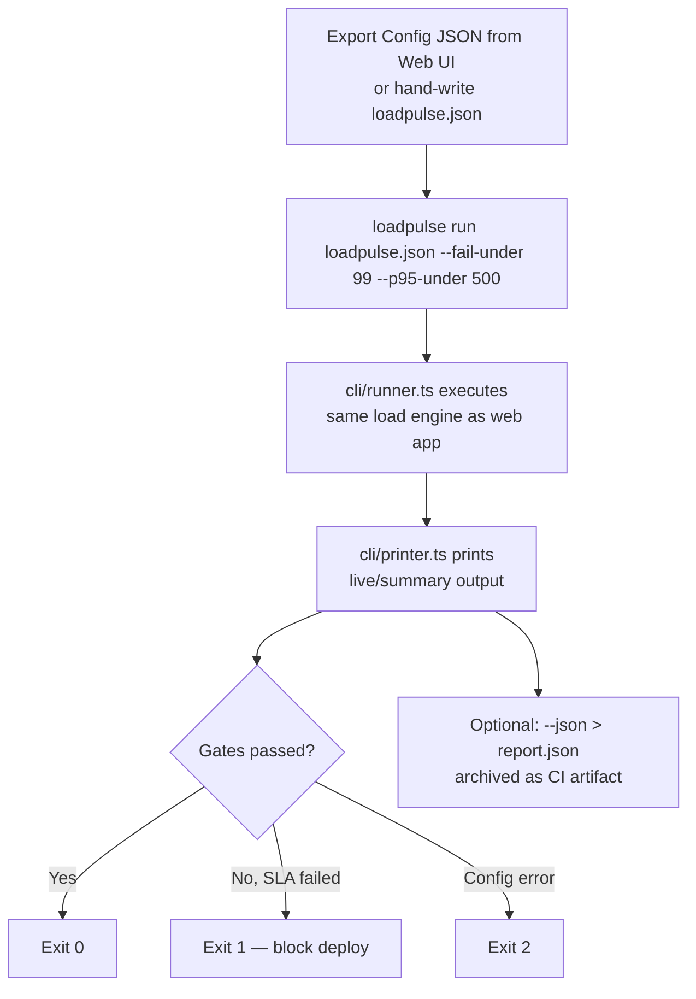

# User Flow (LoadPulse)

## Primary flow — Web App (diagram)


## Primary flow — Web App (steps)
```
1. Land on Test Builder
2. Paste cURL command (or import Postman collection)
        ↓ curlParser.ts / postmanParser.ts
3. Config auto-fills: URL, method, headers, body
4. Pick a load pattern (Constant / Ramp / Step / Spike / Soak)
5. Set concurrency, duration/rate params
6. (Optional) Configure success criteria
   (status range, latency threshold, body keyword, error-rate auto-stop)
7. (Optional) Add a chaining step
   (run an auth request first → extract token → inject into headers/body)
8. Click "Run"
        ↓ fetcher.ts drives requests per loadPatterns.ts schedule
9. Watch live charts update (latency, throughput, status codes)
10. Test ends (duration elapsed / auto-stopped on error threshold)
11. View results: Apdex score, percentiles, failure groups
12. Export: Config JSON | Report JSON | Share URL
```

## Secondary flow — Share a report

```
1. User clicks "Share"
        ↓ shareReport.ts encodes ReportData into URL
2. URL copied / sent to teammate
3. Teammate opens URL → report renders client-side, no server round-trip
```

## Secondary flow — CLI in CI

```
1. Export Config JSON from the Web UI (or hand-write loadpulse.json)
2. `loadpulse run loadpulse.json --fail-under 99 --p95-under 500`
        ↓ cli/runner.ts executes the same load engine as the web app
3. `cli/printer.ts` prints live/summary output to terminal
4. Process exits: 0 (pass) / 1 (SLA gate failed) / 2 (config error)
5. Optional: `--json > report.json` archived as a CI artifact
```

## Error / edge paths
- Invalid cURL string → parser error shown inline, user corrects and re-imports
- Network failure mid-test → captured as a failure group (`type: 'net'`), test continues
- Error rate crosses `errStopPct` → test auto-stops early, partial report generated
