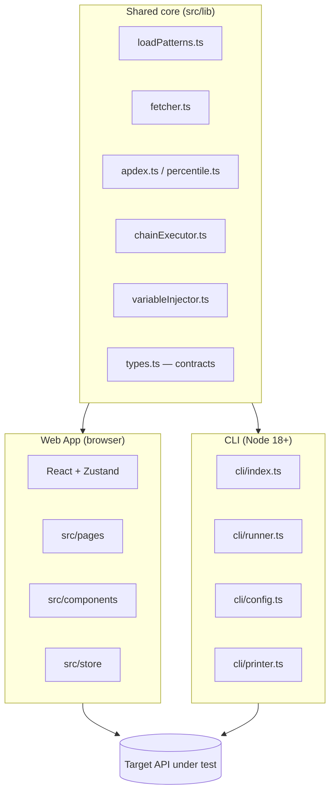

# System / Component Design (LoadPulse)

## 1. High-level architecture
LoadPulse has **no backend**. Two entry points share the same core load-engine logic:



```
                ┌───────────────────────┐
                │   Shared core (lib)    │
                │  loadPatterns.ts       │
                │  fetcher.ts            │
                │  apdex.ts / percentile │
                │  chainExecutor.ts      │
                │  variableInjector.ts   │
                │  types.ts (contracts)  │
                └──────────┬─────────────┘
                           │
        ┌──────────────────┴──────────────────┐
        │                                      │
┌───────▼────────┐                    ┌────────▼────────┐
│   Web App        │                    │      CLI          │
│ React + Zustand   │                    │  cli/index.ts     │
│ (src/pages,        │                    │  cli/runner.ts     │
│  src/components,   │                    │  cli/config.ts      │
│  src/store)         │                    │  cli/printer.ts       │
│ Runs in browser     │                    │ Runs in Node (18+)     │
└─────────────────┘                    └───────────────────┘
```

## 2. Core engine responsibilities
- **`loadPatterns.ts`** — given a `PatternType` + config, generates the request-rate schedule (constant/ramp/step/spike/soak)
- **`fetcher.ts`** — fires HTTP requests per the schedule, respects `concur` (concurrency) and `timeout`, records `ChartPoint`/`LogEntry`
- **`chainExecutor.ts` + `variableInjector.ts`** — runs an auth/setup request first, extracts a value, injects it into the load-test request's headers/body
- **`apdex.ts` / `percentile.ts`** — post-process latency samples into Apdex score, p95/p99
- **`types.ts`** — the single source of truth for `TestConfig` / `ReportData` / `RunRecord` shapes, consumed by both Web and CLI

## 3. Web App layer
- **React 19** components (`src/components`) — pure UI, no business logic
- **Zustand stores** (`src/store`) — `testStore` (live run state), `historyStore` (past runs)
- Charts subscribe to store updates for live rendering during a run
- No server calls except to the target API under test — reports/config are client-side only (URL encoding or file export)

## 4. CLI layer
- **`cli/config.ts`** — loads/validates `loadpulse.json` (same `TestConfig` shape, or CLI flags override)
- **`cli/runner.ts`** — invokes the same core engine (`fetcher.ts`, `loadPatterns.ts`) as the web app, headless
- **`cli/printer.ts`** — terminal output (live progress + summary table)
- **`cli/index.ts`** — argument parsing, exit-code logic (0/1/2)

## 5. Build/package pipeline
- `vite build` → static web app (deployable to GitHub Pages / any static host)
- `esbuild cli/index.ts` → single bundled ESM file `dist-cli/loadpulse.mjs`, published to npm as `loadpulse`
- Both builds share `src/lib` — **no code duplication** between Web and CLI engines

## 6. Key design decisions
- **No backend** → simplifies distribution (npm + static hosting), but caps load to what one browser tab / one Node process can generate
- **Shared core lib** between Web and CLI → guarantees identical test semantics whether run interactively or in CI
- **URL-encoded sharing** instead of a database → zero infra cost, but report size is bounded by URL length limits (large failure-body logs should be truncated/omitted before encoding)

## 7. Known constraints / future considerations
- Single-process load generation — no distributed workers (ties to PRD open question)
- Browser tab throttling (background tabs) can affect load accuracy in the Web App — CLI is the accurate mode for CI
