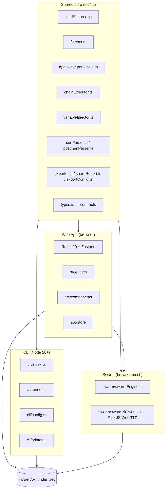

# System / Component Design (LoadPulse)

## 1. High-level architecture
LoadPulse has **no backend**. Three entry points share the same core load-engine logic:



```
                ┌───────────────────────┐
                │   Shared core (lib)    │
                │  loadPatterns.ts       │
                │  fetcher.ts            │
                │  apdex.ts / percentile │
                │  chainExecutor.ts      │
                │  variableInjector.ts   │
                │  curl/postman parsers  │
                │  exporters             │
                │  types.ts (contracts)  │
                └──────────┬─────────────┘
                           │
        ┌──────────────────┼───────────────────────┐
        │                  │                         │
┌───────▼────────┐  ┌──────▼────────┐      ┌─────────▼─────────┐
│   Web App       │  │  Swarm mesh   │      │       CLI          │
│ React + Zustand │  │ swarmEngine + │      │  cli/index.ts      │
│ (pages,          │  │ swarmNetwork  │      │  cli/runner.ts     │
│  components,     │  │ (PeerJS/WebRTC│      │  cli/config.ts     │
│  store)          │  │  peer-to-peer)│      │  cli/printer.ts    │
│ Runs in browser  │  │ N browsers    │      │ Runs in Node (20+) │
└─────────────────┘  └───────────────┘      └────────────────────┘
```

## 2. Core engine responsibilities
- **`loadPatterns.ts`** — given a `PatternType` + config, computes the instantaneous target rate (`getRps`), duration, concurrency, and timeout for constant/ramp/step/spike/soak
- **`fetcher.ts`** — fires HTTP requests per the schedule, respects `concur` (concurrency) and `timeout`, records `ChartPoint`/`LogEntry`, classifies failures (`net`/`h4`/`h5`)
- **`curlParser.ts` / `postmanParser.ts`** — turn a pasted cURL or a Postman v2.0/v2.1 collection into a `ParsedCurl`
- **`variableInjector.ts`** — expands dynamic placeholders (`{{uuid}}`, `{{seq}}`, `{{email}}`, `{{phone}}`, `{{random_int}}`, `{{random_str}}`, `{{timestamp}}`, `{{repeat_uuid:n}}`) per request; supports disjoint per-node sequence blocks so swarm nodes never collide
- **`chainExecutor.ts`** — runs an auth/setup request first, extracts a value (JSON dot-path or header), injects it as a `{{chain.*}}` var into the load-test request
- **`apdex.ts` / `percentile.ts`** — post-process latency samples into Apdex score/rating, SLA rule checks, and p95/p99
- **`exporter.ts` / `shareReport.ts` / `exportConfig.ts`** — CSV + Excel (`.xlsx`, dynamic `xlsx` import), base64 share-URL encode/decode, and the `CliExportConfig` JSON download
- **`types.ts`** — the single source of truth for `TestConfig` / `ReportData` / `RunRecord`, consumed by Web, Swarm, and CLI

## 3. Web App layer
- **React 19** components (`src/components`) — UI (charts, inputs, report/export, QR, per-node bars)
- **Zustand stores** (`src/store`) — `testStore` (solo live run), `historyStore` (past runs, `localStorage`-persisted), `swarmStore` (swarm session)
- Charts subscribe to store updates for live rendering during a run
- Shipped as an installable **PWA** (`vite-plugin-pwa`, `autoUpdate`, Workbox precache + runtime caching of fonts and lazy chunks)
- No server calls except to the target API under test — reports/config are client-side only (URL encoding or file export)

## 4. Swarm layer (distributed, peer-to-peer)
- **`swarm/swarmNetwork.ts`** — transport over **PeerJS / WebRTC data channels**. The host claims a well-known peer id (`loadpulse-swarm-<code>`); joiners dial it. ICE uses Google STUN + a shared public `openrelay.metered.ca` TURN relay for restrictive NATs.
- **`swarm/swarmEngine.ts`** — each node runs `runSwarmSlice`, the same `loadPatterns`+`fetcher` engine scaled by a live share fraction so N nodes together approximate the configured aggregate rate; emits ~1s batched sample windows to the host.
- **Features** — optional passcode auth, kick-node, live rebalancing as nodes join/leave, disjoint `{{seq}}` blocks per node, host-side aggregation, and JSON swarm-report export.
- **Not in the CLI** — swarm is a browser-only feature; the CLI is single-process.

## 5. CLI layer
- **`cli/config.ts`** — parses argv and loads `loadpulse.json` (a `CliExportConfig`, *not* the raw `TestConfig`); CLI flags override config-file fields per key. No runtime schema validation beyond requiring a resolvable cURL.
- **`cli/runner.ts`** — invokes the same core engine (`fetcher.ts`, `loadPatterns.ts`, `variableInjector.ts`) as the web app, headless
- **`cli/printer.ts`** — terminal output (banner, live progress, summary table) to **stderr**, plus gate evaluation (`evaluateGates`)
- **`cli/index.ts`** — orchestration + exit-code logic (0/1/2); `--json` prints `ReportData` to **stdout**
- The CLI is a deliberate subset: status-range gate only, no chaining/Postman/swarm/Apdex in output (see `09-cli-design.md`)

## 6. Build/package pipeline
- `tsc -b` typechecks the app + node projects (`tsconfig.app.json`, `tsconfig.node.json`; both `noEmit`), then `vite build` → static web app in `dist/` (PWA assets included), deployable to GitHub Pages / any static host
- `esbuild cli/index.ts` → single bundled ESM file `dist-cli/loadpulse.mjs` (`--target=node18` for output compat), published to npm as `loadpulse`; only `dist-cli/` is in the npm `files` allowlist
- Note: `tsconfig.cli.json` is **not** referenced by the root `tsc -b`, so the CLI is transpiled by esbuild but not type-checked in the build
- Both builds share `src/lib` — **no code duplication** between Web, Swarm, and CLI engines

## 7. Key design decisions
- **No backend** → simplifies distribution (npm + static hosting). Solo/CLI load is capped to one browser tab / one Node process; **swarm lifts that cap** by pooling many peers, but each peer is still just a browser tab.
- **Shared core lib** across Web, Swarm, and CLI → identical test semantics wherever a test runs
- **Peer-to-peer swarm** instead of a server-managed worker fleet → zero infra, but reliability depends on WebRTC NAT traversal and a shared public TURN relay
- **URL-encoded sharing** (base64 JSON in the `#data=` fragment) instead of a database → zero infra cost. ⚠️ There is currently **no URL-length guard or body truncation** in `shareReport.ts`; failure `bodies` are only loosely bounded (the CLI keeps ≤2 per group), so a run with many large failure bodies can produce an over-long share URL. Capping before encode is a known TODO (see `05-report-schema.md`).

## 8. Known constraints / future considerations
- Each load generator is a single browser tab or Node process; swarm scales horizontally across peers but not within a peer
- Browser tab throttling (background tabs) can affect load accuracy in the Web App — CLI is the accurate mode for CI
- Swarm relies on public STUN/TURN; a first-party TURN server would improve reliability behind strict NATs (PRD open question)
