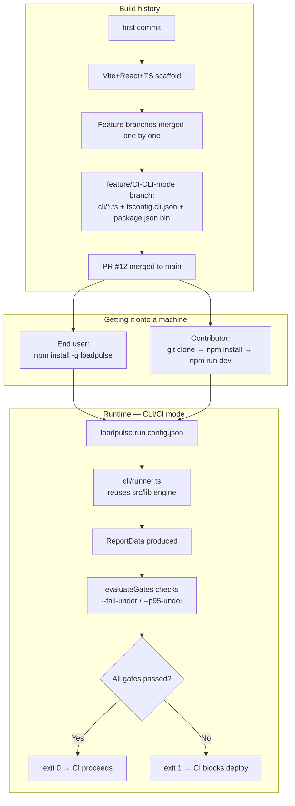

# How LoadPulse Was Built — Setup, CLI/CI Mode, Local Dev (Detailed)

This doc explains **how the project actually came together**: repo setup, how the CLI/CI mode was added, how to get it onto your machine (Desktop), and how everything wires together end to end. Reconstructed from `git log`, `package.json`, and the `cli/` + `tsconfig.cli.json` source.

---

## 1. Project origin (git history)

```
eafbbe8  first commit
37769ba  Add LoadPulse app — Vite + React + TypeScript load tester   ← base web app scaffolded
0248895  Feature main (#6)
33607b2  feat: add /docs route with full usage guide (#7)
...      (feature branches merged one by one — see below)
8ef5543  Feature/common main (#11)
8f9eaab  feat: introduce LoadPulse CLI for load testing               ← CLI/CI mode added here
9910830  feat: introduce LoadPulse CLI for load testing (#12)          ← merged to main via PR #12
0648990  Create SECURITY.md
e99726c  docs: overhaul README for LoadPulse
```

Workflow used throughout: **one feature branch per feature → PR → merge to `main`**. Branch list still in the repo (`git branch -a`) shows the pattern:
```
feature/ux-improvements        feature/latency-percentiles
feature/pwa                    feature/request-chaining
feature/csv-export             feature/postman-import
feature/apdex-sla              feature/shareable-reports
feature/common-main            feature/CI-CLI-mode   ← CLI work happened here
feature/docs                   feature/readme-LoadPulse
```

Each feature (Apdex/SLA, Postman import, shareable reports, CSV export, request chaining, etc.) was built in isolation, then merged into `feature/common-main`, and periodically fast-forwarded into `main`.

---

## 2. How "CI/CLI mode" was built

"CI/CLI mode" = the `loadpulse` CLI, purpose-built so a CI pipeline can run a load test and **gate a deploy** on the result (pass/fail exit code), not a GitHub Actions workflow *for this repo* — there is currently no `.github/workflows/` in this project. It's the CLI itself acting as the CI integration point.

### 2.1 What was added (branch `feature/CI-CLI-mode`, commit `8f9eaab`)
```
cli/config.ts                          183 lines  — parses CLI flags + loadpulse.json config
cli/index.ts                            72 lines  — entrypoint, argv parsing, exit-code logic
cli/printer.ts                         214 lines  — terminal output (banner, live progress, report, gates)
cli/runner.ts                          137 lines  — drives the actual load test (reuses src/lib engine)
tsconfig.cli.json                       26 lines  — separate TS project just for the CLI
src/lib/exportConfig.ts                128 lines  — "Export Config" JSON used by the CLI
src/components/ExportConfigButton.tsx   30 lines  — Web UI button to export a loadpulse.json
package.json                            +20/-5    — added `bin`, `build:cli`, `prepare`, `loadpulse` scripts
```

### 2.2 Why it's a *separate* TypeScript project (`tsconfig.cli.json`)
The CLI runs in **Node**, the web app runs in the **browser** — different `lib`/`types` targets. So `tsconfig.cli.json` only includes what the CLI needs:
```json
"include": [
  "cli/**/*.ts",
  "src/lib/types.ts",
  "src/lib/curlParser.ts",
  "src/lib/fetcher.ts",
  "src/lib/loadPatterns.ts",
  "src/lib/percentile.ts",
  "src/lib/variableInjector.ts"
]
```
This is the practical proof of the "shared core" design from `04-system-design.md` — the CLI directly imports the same `src/lib/*` files the web app uses, so the load-testing logic is identical in both places. No duplicate engine.

### 2.3 How the CLI is packaged
`package.json`:
```json
"bin": { "loadpulse": "dist-cli/loadpulse.mjs" },
"files": ["dist-cli/"],
"scripts": {
  "build:cli": "esbuild cli/index.ts --bundle --platform=node --target=node18 --outfile=dist-cli/loadpulse.mjs --format=esm && chmod +x dist-cli/loadpulse.mjs",
  "prepare": "npm run build:cli",
  "loadpulse": "tsx cli/index.ts"
}
```
- `esbuild` bundles `cli/index.ts` (and everything it imports from `src/lib`) into **one file**: `dist-cli/loadpulse.mjs`
- `chmod +x` makes it directly executable
- `"bin"` tells npm: when someone runs `npm install -g loadpulse`, symlink this file to a global `loadpulse` command
- `"prepare"` auto-runs the CLI build on `npm install`/`npm publish` — so the published package always ships a fresh build
- `npm run loadpulse` (dev script) runs the **unbundled** TS directly via `tsx`, for fast local iteration without rebuilding

### 2.4 How the CLI actually enforces "CI gating" (the core mechanic)
Look at `cli/index.ts`:
```ts
const gateResults = evaluateGates(report, cfg.gates)
const allPassed = gateResults.every(g => g.passed)
process.exit(allPassed ? 0 : 1)
```
- Gates = the `--fail-under` / `--p95-under` thresholds from `05-report-schema.md`'s success-criteria fields
- Test run happens → `runner.ts` produces a `ReportData` → `evaluateGates` checks it against the thresholds → **exit code 0/1** is the actual "CI integration"
- A CI pipeline (GitHub Actions, GitLab CI, Jenkins, anything) just needs to run `loadpulse run config.json` as a step and check the exit code — that's the entire contract. Exit code `2` = config/parse error (handled separately in the `catch` blocks), distinct from a gate failure.

### 2.5 If you want to add *actual* CI (GitHub Actions) for this repo
Currently there's no `.github/workflows/*.yml` in the repo — lint/build/publish are run manually per the README's contributing section. To automate it, a workflow would look like:
```yaml
# .github/workflows/ci.yml (not yet present — proposal)
on: [push, pull_request]
jobs:
  build:
    runs-on: ubuntu-latest
    steps:
      - uses: actions/checkout@v4
      - uses: actions/setup-node@v4
        with: { node-version: 18 }
      - run: npm install
      - run: npm run lint
      - run: npm run build
      - run: npm run build:cli
```
This is a **future addition**, not something already in the repo — flagging so it isn't confused with the `loadpulse` CLI's own CI-gating feature described above.

---

## 3. How to get it onto your machine (Desktop) — two separate things

### 3.1 Using LoadPulse (as an end user) — no cloning needed
```bash
npm install -g loadpulse
loadpulse run --curl "curl https://api.example.com/health" --rate 20 --duration 60 --fail-under 99 --p95-under 500
```
This pulls the published npm package (`dist-cli/loadpulse.mjs`, already built) — nothing to build yourself.

### 3.2 Working on the source (what's on this Desktop right now)
This exact flow is what got the repo onto `/Users/ni005/Desktop/api-load-tester`:
```bash
git clone https://github.com/Ayush2966/LOAD-PULSE.git
cd LOAD-PULSE
npm install          # installs deps AND triggers "prepare" → builds the CLI once
npm run dev          # starts the web app → http://localhost:5173
```
Current repo state here: branch `feature/readme-LoadPulse`, remote `origin` → `https://github.com/Ayush2966/LOAD-PULSE.git`, working tree clean.

### 3.3 Local commands cheat-sheet (from `package.json`)
| Command | What it does |
|---|---|
| `npm install` | Install deps; also runs `prepare` → builds CLI |
| `npm run dev` | Vite dev server for the web app |
| `npm run build` | Type-check (`tsc -b`) + production web build → `dist/` |
| `npm run build:cli` | Bundle CLI → `dist-cli/loadpulse.mjs` |
| `npm run loadpulse -- run <config>` | Run the CLI from source (no build needed, via `tsx`) |
| `npm run lint` | `oxlint` static analysis |
| `npm run preview` | Preview the production web build locally |

---

## 4. End-to-end picture



---

## 5. Key takeaways
- "CI/CLI mode" is the `loadpulse` CLI tool itself — its whole purpose is to be the thing CI pipelines call; it is not a CI pipeline configured *for* this repo.
- It shares the exact same load-testing engine (`src/lib/*`) as the web app — built once, used from two entrypoints (see `04-system-design.md`).
- Desktop setup is a standard `git clone` + `npm install` (dev) or `npm install -g loadpulse` (just using it) — no special steps beyond Node 18+.
- Actual GitHub Actions automation for *this repo's own* lint/build/publish is not yet set up — see §2.5 for a starting proposal if that's wanted next.
